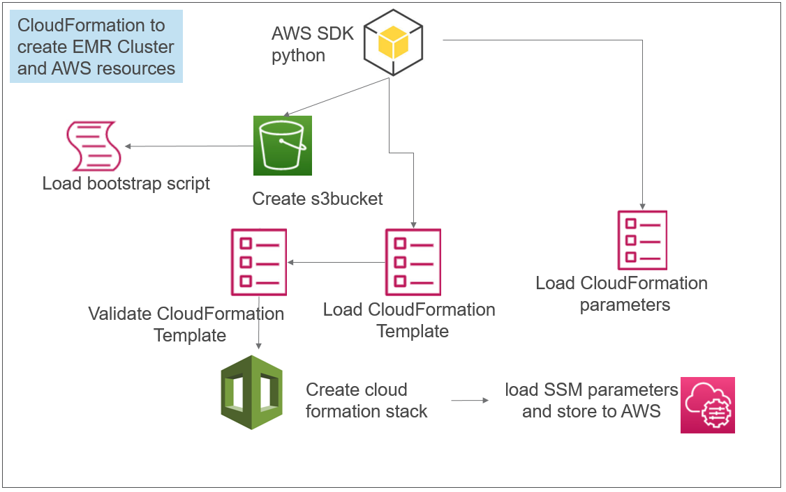
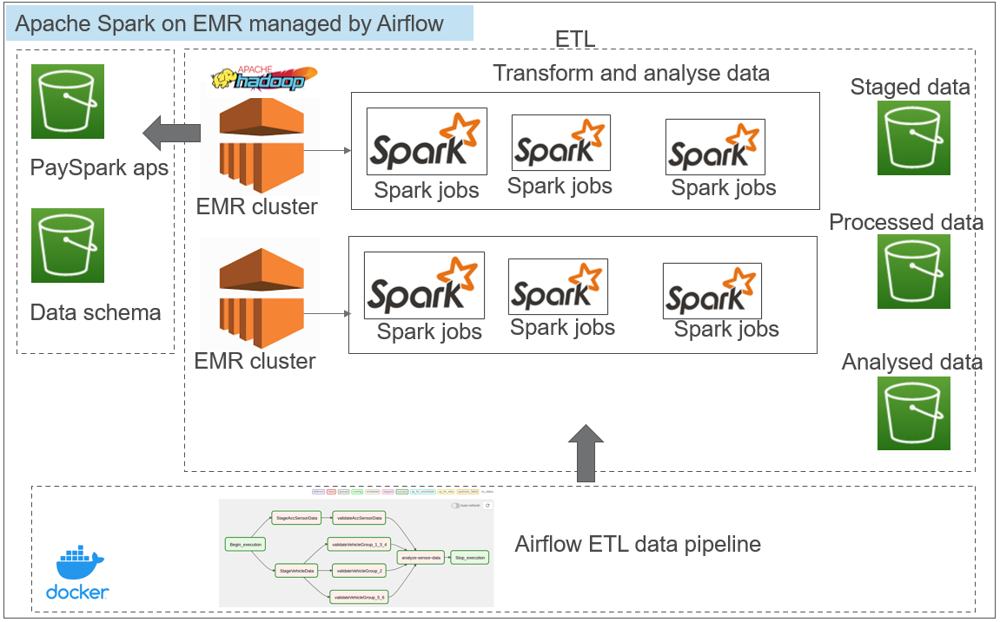
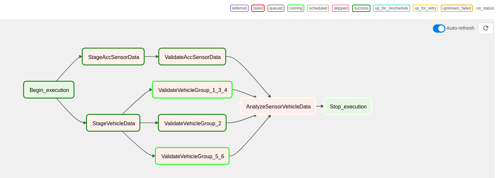
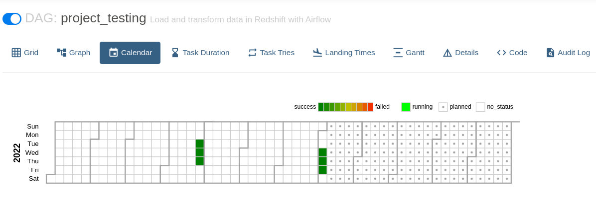
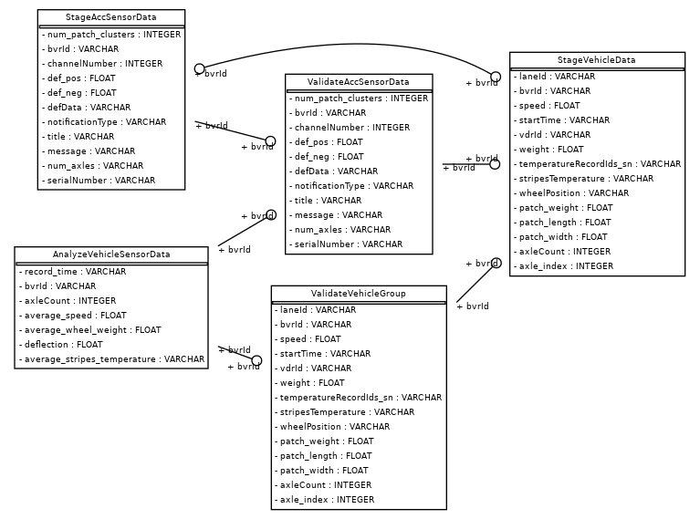

# PySpark Big data on Amazon EMR Managed by Airflow

## Overview
As stated in AWS, one of most used Cloud-based big data platform to process and analyze a big data is using Amazon Elastic MapReduce (Amazon EMR) and an open source tools such as Apache Spark, Hive, Hadoop and others.

In this project there are two dataset sources vehicle data (*data-lake-pro-bvr-data*) and sensor data (*data-lake-pro-acc-data*). These raw data contains a nested json files in string format. The goal of this project part is to run ETL process, check the data quality (validate the data if it contains the required information) and finally merge and prepare the two datasets for further analysis.

The tools that are used in the project includes 
- AWS EMR cluster - as it suitable to process Spark application to execute ETL process of a big data efficiently
- ApacheSpark - running on distributed EMR clusters with auto-terminating spark jobs, as the fee is only for time of up and running. This is cost effective, since the dataset is collected through out the whole day and can be executed once per day once in few minutes on EMR cluster.
- Apache Airflow - managing the data pipeline for ETL process.

The project consists of two parts
- AWS EMR stack cloudformation
- Airflow managed ETL data pipe line and data analysis using spark Auto-terminating jobs

The cloud formation parts includes creating all the resources that are needed to run the second step. The following resources are created in AWS using the *jaml* and python script.

- __data-lake-pro-logs__ : logging the EMR cluster output and PySpark application (python scripts) hadoop
- __data-lake-pro-work-bucket__: storing pyspark application scripts
- __data-lake-pro-acc-data__: raw data gathered from sensors
- __data-lake-pro-bvr-data__: raw data gathered from Vehicles
- __data-lake-pro-bootstrap__: boostrap script for setting up the spark environment on EMR
- __data-lake-pro-processed-data__: process data storage
- __data-lake-pro-schema-data__: schema for mapping the multi nested json data to pyspark dataframe 
- __data-lake-pro-analyzed-data__: storage of the final analyzed data
moreover the VPC and Internet gateway to AWS EMR cluster is created using the the first step. The diagram below shows the cloud formation on AWS to create resources for EMR cluster and pySpark application

## work-flow Architecture

## - CloudFormation to create EMR cluster and resources
The cloudformation allows to create AWS resources for AWS Elastic MapReduce (EMR) to interact with Apache Spark using Python API called PySpark.The cloudformation is created using *yaml* file and *python* script.


  
  
## - Apache Spark on EMR cluster using Airflow DAGs
The data pipeline is manged by Apache Airflow, with Apache Spark + Hadoop. This is done through a *PythonOperator* plugin to read the data from AWS S3 buckets, process the data using pySpark application (python scripts) running on EMR cluster (EC2 instances) and store the processed data on AWS s3 server in Parquet format. Partitioning and compression of the data is done for fast read performance. Since the Spark jobs will be auto-terminated after job task is done, This method is cost effective, as the fee is for the time of EMR cluster up and running. PySpark allows to run the spark application in a distributed system on a cloud which is more effcient in processing a big amount of the data. [For more detailed information of Spark API see the official documentation.](https://spark.apache.org/docs/latest/api/python/)




## Data pipeline workflow (Apache Airflow)
The data pipeline tasks are created using Apache Airflow. Directed Acyclic Graph (DAG) which allows to setup a data pipeline or analysis tasks which has dependencies and relation to each other, as well as it is able to schedule each tasks as requried by the user. [For more detailed information see official documentation of DAGs.](https://airflow.apache.org/docs/apache-airflow/stable/concepts/dags.html)

The following tasks are included in the DAG
-__StageAccSesnorData__: reads raw sensor data from AWS s3 buckets, process the data  and sore the stage data in s3 bucket
-__StageVehicleData__: reads vehicle data from AWS s3 buckets, process the data and sore the stage data in s3 bucket
-__ValidateAccSensorData__:reads staged sensor data from AWS s3 buckets, clean and validate the data and sore them as processed data in s3 bucket.
-__ValidateVehicleGroup__:reads staged vehicle data from AWS s3 buckets, clean and validate the data and sore them as processed data in s3 bucket. The tasks are sub-divided in to three groups if vehicles to trigger the analysis at once on separate EMR cluster. under each task there are multiple steps 
-__Analyze-sensor-vehicle-data__:reads the processed sensor and vehicle data from AWS s3 buckets, perform data analysis and sore them as analyzed data in s3 bucket.



## Backfill Airflow DAGs test
For testing purpose the buckfill operation is execured for few days, the sucess DAG runs results are shown below


## Data Warehouse Entity Relationship Diagram (Data Schema)
The Airflow DAGs output the following data structure. The tables are stored in AWS s3 bucket, at each step. The dataset is read using Spark application (python scripts) running on EMR AWS cluster. 

## Processed data output size 
If the dataset size is increased by 100X
- It is possible to configure the *"job flow steps"* with high capacity of *InstanceType*. This is defined in a function "*__run_job_flow__*" . There are a list of instance types in [please see the AWS instance capacity list.](https://docs.aws.amazon.com/AWSEC2/latest/UserGuide/compute-optimized-instances.html)

The following data sizes are extracted from log files  

- [2022-09-02 10:33:42,443] INFO - DAY 2022-08-03 analyze_data rows= 1977336 and columns=30
- [2022-09-01 10:33:04,626] INFO - DAY 2022-08-03 process_data rows= 1002312 and columns=30

## How to start, kill the scheduler and webserver using CLI
To start the Airflow backfill operation 
```
airflow dags backfill -s <start-date> -e <end-date> data_lake_test_prod
```
To kill Airflow scheduler:

```
$ kill $(ps -ef | grep "airflow scheduler" | awk '{print $2}')
```

To kill Airflow webserver:

```
$ cat $AIRFLOW_HOME/airflow-webserver.pid | sudo xargs kill -9
```

